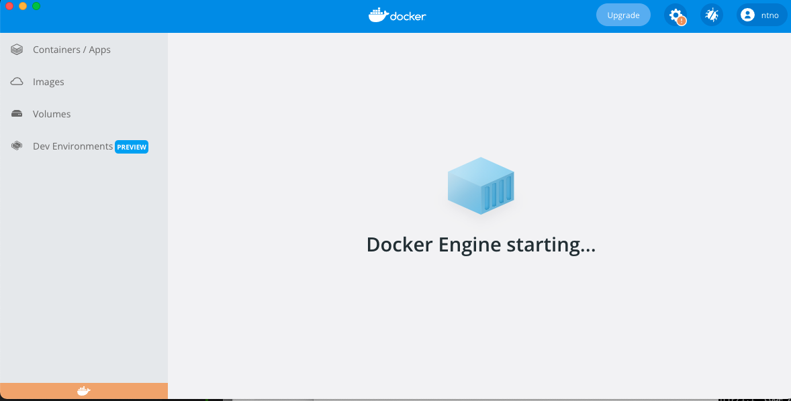
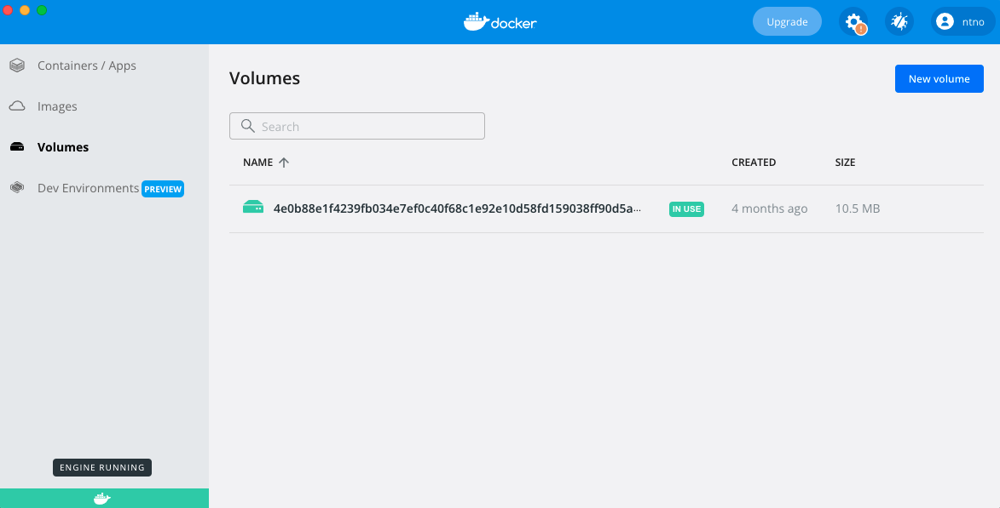
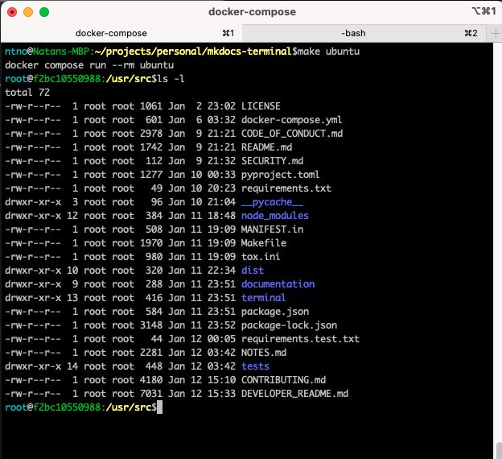

# Terminal for MkDocs Theme Development
Use this readme to add a feature to this theme or to update the theme documentation.

## Quicklinks

- [Terminal for MkDocs Theme Development](#terminal-for-mkdocs-theme-development)
  - [Quicklinks](#quicklinks)
  - [Developer Setup](#developer-setup)
    - [Prerequisites](#prerequisites)
    - [Fork and Clone Repository](#fork-and-clone-repository)
    - [Confirm Setup](#confirm-setup)
  - [Documentation Updates](#documentation-updates)
    - [Create a Feature Branch](#create-a-feature-branch)
    - [Push Local Branch to Remote Repository](#push-local-branch-to-remote-repository)
    - [Start Local Documentation Server](#start-local-documentation-server)
    - [Make Documentation Updates](#make-documentation-updates)
    - [Push Changes and Create PR](#push-changes-and-create-pr)
  - [Theme Updates](#theme-updates)
    - [Create a Feature Branch](#create-a-feature-branch-1)
    - [Push Local Branch to Remote Repository](#push-local-branch-to-remote-repository-1)
    - [Bump Theme Version](#bump-theme-version)
    - [Start Documentation Server with Local Theme](#start-documentation-server-with-local-theme)
    - [Make Updates](#make-updates)
    - [Test Theme Build/Packaging Locally](#test-theme-buildpackaging-locally)
    - [Add Functional Tests](#add-functional-tests)
    - [Push Changes and Create PR](#push-changes-and-create-pr-1)
    - [Review PR Build](#review-pr-build)


## Developer Setup
Development for this project is done within [Docker containers].  Using Docker containers makes setup easy because all developer workspaces will have the same installed software / OS.  If there's a tool that is not available that you think would be helpful to add to the default container image, please feel free to [open an Issue](https://github.com/ntno/mkdocs-terminal/issues/new/choose) and start a discussion.  

*Note*: All software besides the two prerequisites will be installed in the Docker container and not your machine.

[Docker containers]: https://www.docker.com/resources/what-container/

### Prerequisites
- install [docker](https://docs.docker.com/get-docker/)
- install [Make](https://www.gnu.org/software/make/)

### Fork and Clone Repository
- [Fork mkdocs-terminal](https://github.com/ntno/mkdocs-terminal/fork)  
- Clone your fork: `git clone git@github.com:YOUR_GIT_USERNAME/mkdocs-terminal.git`

### Confirm Setup
Test your system's docker setup by running the documentation site server locally:

```bash
cd mkdocs-terminal  
make serve-docs
```

You should be able to visit [http://0.0.0.0:8080/mkdocs-terminal/](http://0.0.0.0:8080/mkdocs-terminal/) in your browser and view the mkdocs-terminal documentation site.  

If you get a `docker.sock: connect: permission denied` error, you probably need to start the Docker engine on your machine.  

**Example Error**:
```log
Got permission denied while trying to connect to the Docker daemon socket at unix:///var/run/docker.sock: Get "http://%2Fvar%2Frun%2Fdocker.sock/v1.24/containers/json?all=1&filters=%7B%22label%22%3A%7B%22com.docker.compose.project%3Dmkdocs-terminal%22%3Atrue%7D%7D&limit=0": dial unix /var/run/docker.sock: connect: permission denied
make: *** [ubuntu] Error 1
```

**Solution**:
Open the Docker Desktop application and wait until the application indicates that the Docker engine is in a "running" state.  Then retry starting your docker container.  





## Documentation Updates

### Create a Feature Branch
Create a local branch to track your updates.  Include the topic of the feature in your branch name.  Example:  

```bash
git checkout -b docs-add-css-override-instructions
```

### Push Local Branch to Remote Repository
```bash
git push --set-upstream origin docs-add-css-override-instructions
```

### Start Local Documentation Server
```bash
make serve-docs
```

### Make Documentation Updates
- Update existing [documentation pages](documentation/docs)  
- Add any new pages to the documentation site nav in [documentation/mkdocs.yml](documentation/mkdocs.yml)  
- View changes in local server and confirm everything works as expected 
  - confirm images load
  - confirm links are not broken

### Push Changes and Create PR
See [Work On Pull Request](https://github.com/susam/gitpr#work-on-pull-request) for help on adding/pushing changes to your feature branch.  

See [Pull Requests](CONTRIBUTING.md#pull-requests) for instructions on creating a pull request to this repository.


## Theme Updates

### Create a Feature Branch
Create a local branch to track your updates.  Include the topic of the feature in your branch name.  Example:  

```bash
git checkout -b add-timeline-component
```

### Push Local Branch to Remote Repository
```bash
git push --set-upstream origin add-timeline-component
```

### Bump Theme Version
update version in:
- [`package.json`](package.json#L3)
- [`terminal/theme_version.html`](terminal/theme_version.html)

### Start Documentation Server with Local Theme
```bash
make serve-local-theme
```

### Make Updates
Update files in [terminal/](terminal/).  You should see changes loaded in [http://0.0.0.0:8080/mkdocs-terminal/](http://0.0.0.0:8080/mkdocs-terminal/).

- View changes in local server and confirm everything works as expected 
  - confirm images load
  - confirm links are not broken
  - confirm existing components/features still work

### Test Theme Build/Packaging Locally
Launch the project's ubuntu container and run tox build tests:

```bash
make ubuntu
make tox
```

### Add Functional Tests
If you are adding/changing theme functionality, please add a test to the relevant test class in [tests/](tests/).  You can run the test suite locally by using the commands described in this section.  

After you have installed the required testing software you can rerun `make quick-tests` whenever you want to re-execute.

```bash
make ubuntu
make install-test-prereqs
make install-test-requirements
make quick-tests
```

Remember to work in the project's [Docker container](#developer-setup) to avoid Python dependency conflicts.  Once you have run `make ubuntu`, your terminal prompt should include `root@CONTAINER_ID`:




Test suites can always be improved!  Please consider making a contribution or starting a discussion if you have any ideas.  

### Push Changes and Create PR
See [Work On Pull Request](https://github.com/susam/gitpr#work-on-pull-request) for help on adding/pushing changes to your feature branch.  

### Review PR Build

Pull Requests are tested using a [GitHub Action workflow](https://github.com/ntno/mkdocs-terminal/actions/workflows/test.yml).  Check the status of your PR build and resolve any reported issues.
