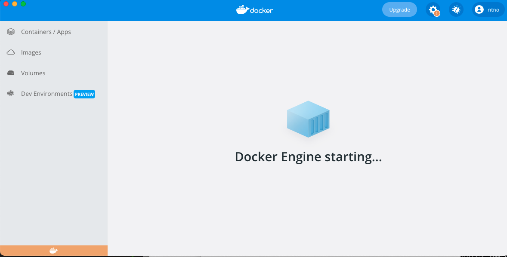
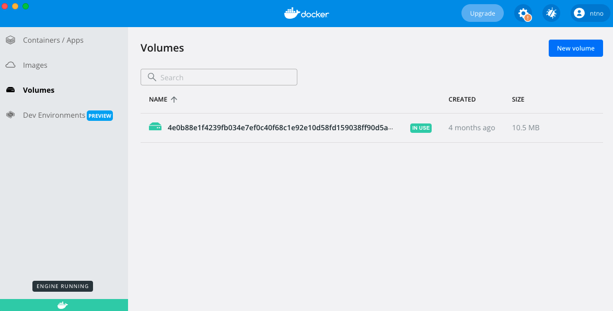

# mkdocs-terminal
mkdocs-terminal is a MkDocs port of the [Terminal.css](https://github.com/Gioni06/terminal.css) theme.  
This theme is currently under development.

## Quick start

terminal.css theme for MkDocs can be installed with `pip`:

``` sh
pip install mkdocs-terminal
```

Add the following lines to `mkdocs.yml`:

``` yaml
theme:
  name: terminal
```

## Documentation
[mkdocs-terminal docs](https://ntno.github.io/mkdocs-terminal/)

## Developer Info
[Terminal for MkDocs on GitHub](https://github.com/ntno/mkdocs-terminal)  
[Terminal for MkDocs on PyPI](https://pypi.org/project/mkdocs-terminal)  

### Terminal for MkDocs Theme Development
To add a feature to this theme or to test documentation site updates, follow the instructions in this section.

#### Developer Setup

##### Prerequisites
- install [docker](https://docs.docker.com/get-docker/)
- install [Make](https://www.gnu.org/software/make/)

##### Fork and Clone Repository
- [Fork mkdocs-terminal](https://github.com/ntno/mkdocs-terminal/fork)  
- Clone your fork: `git clone git@github.com:YOUR_GIT_USERNAME/mkdocs-terminal.git`

##### Confirm Setup
Test your system's docker setup by running the documentation site server locally:

```bash
cd mkdocs-terminal  
make serve-docs
```

You should be able to visit [http://0.0.0.0:8080/mkdocs-terminal/](http://0.0.0.0:8080/mkdocs-terminal/) in your browser and view the mkdocs-terminal documentation site.  

If you get a `docker.sock: connect: permission denied` error, you probably need to start the Docker engine on your machine.  
Open the Docker Desktop application and wait until the application indicates that the Docker engine is in a "running" state.  Then retry starting your docker container.  

  
  


### License

**MIT License**

Copyright (c) 2023 ntno

Permission is hereby granted, free of charge, to any person obtaining a copy
of this software and associated documentation files (the "Software"), to deal
in the Software without restriction, including without limitation the rights
to use, copy, modify, merge, publish, distribute, sublicense, and/or sell
copies of the Software, and to permit persons to whom the Software is
furnished to do so, subject to the following conditions:

The above copyright notice and this permission notice shall be included in all
copies or substantial portions of the Software.

THE SOFTWARE IS PROVIDED "AS IS", WITHOUT WARRANTY OF ANY KIND, EXPRESS OR
IMPLIED, INCLUDING BUT NOT LIMITED TO THE WARRANTIES OF MERCHANTABILITY,
FITNESS FOR A PARTICULAR PURPOSE AND NONINFRINGEMENT. IN NO EVENT SHALL THE
AUTHORS OR COPYRIGHT HOLDERS BE LIABLE FOR ANY CLAIM, DAMAGES OR OTHER
LIABILITY, WHETHER IN AN ACTION OF CONTRACT, TORT OR OTHERWISE, ARISING FROM,
OUT OF OR IN CONNECTION WITH THE SOFTWARE OR THE USE OR OTHER DEALINGS IN THE
SOFTWARE.
