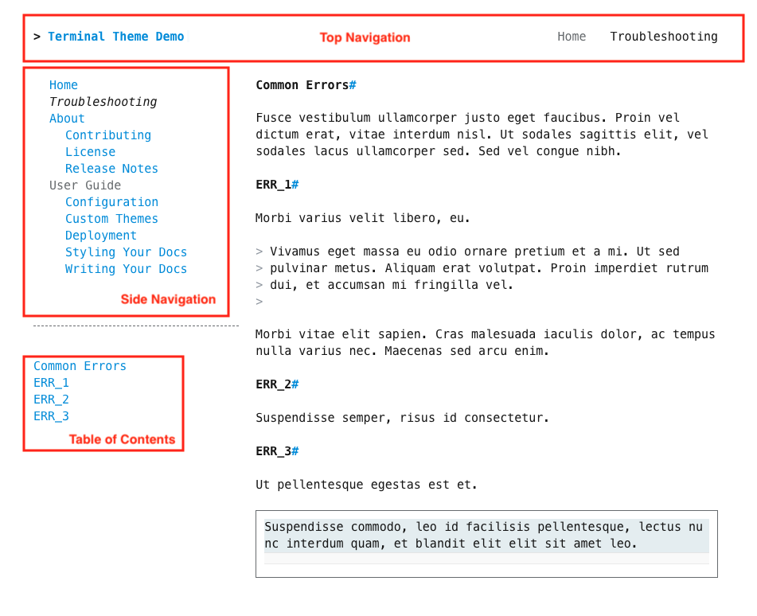

# Theme Components

The MkDocs Terminal theme layout consists of three major components.  The top navigation bar, the side navigation bar, and the page table of contents.  Each of these components can be hidden site-wide (see [Theme Features](./features.md)), however they are enabled by default.

<section markdown>
<figure markdown>
{title="Hideable UI Components"; alt="screenshot with hideable MkDocs Terminal components annotated" .terminal-mkdocs-thin-border }
<figcaption>Hideable UI Components</figcaption>
</figure>
</section>

## Top Navigation Menu

This component includes the `site_name` at the top left and the top level pages as defined in the `nav` section of `mkdocs.yml` at the top right:

```yaml
site_name: Terminal Theme Demo
nav:
    - Home: 'index.md'
    - Troubleshooting: 'help.md'
```

## Side Navigation Menu

This component includes the first through second level pages as defined in the `nav` section of `mkdocs.yml` in the left sidebar:

```yaml
nav:
    - Home: 'index.md'
    - Troubleshooting: 'help.md'
    - About: 
      - Contributing: 'about/contributing.md'
      - License: 'about/license.md'
      - Release Notes:
        - v1: 'about/release-notes/version-1.md'
        - v2: 'about/release-notes/version-2.md'
```

## Page Table of Contents

The table of contents component is located directly underneath the side-nav component.  It includes links to the the top two sections in the current page's markdown.  See [TOC Example](../navigation/toc.md) for details.


