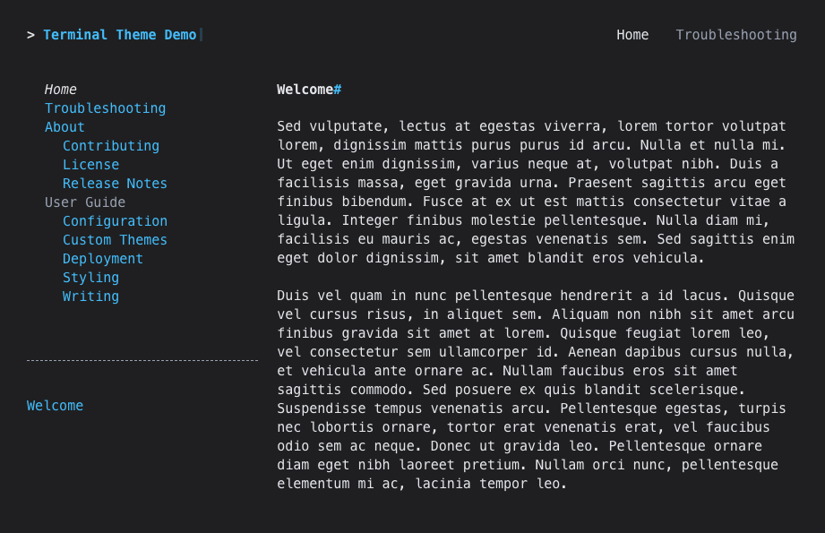

# Dark Palette

{title='Dark Color Palette'; alt='screenshot of demo site with the dark color palette.  the site uses a black background with light blue hyperlinks and white text.'; class='palette_example'}

To use the dark color palette, add the `palette` attribute to your theme configuration in `mkdocs.yml`:

```yaml
theme:
  name: terminal
  palette: dark
```