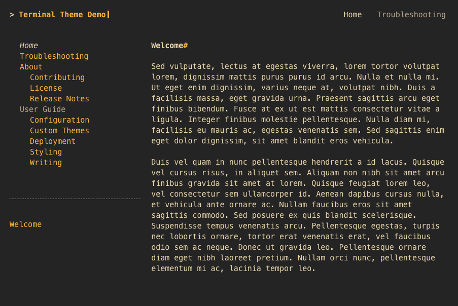

# Gruvbox Dark Palette

{title='Gruvbox Dark Color Palette'; alt='screenshot of demo site with the gruvbox_dark color palette.  the site uses a dark grey background with orange hyperlinks and light yellow text.'; class='palette_example'}

To use the gruvbox_dark color palette, add the `palette` attribute to your theme configuration in `mkdocs.yml`:

```yaml
theme:
  name: terminal
  palette: gruvbox_dark
```