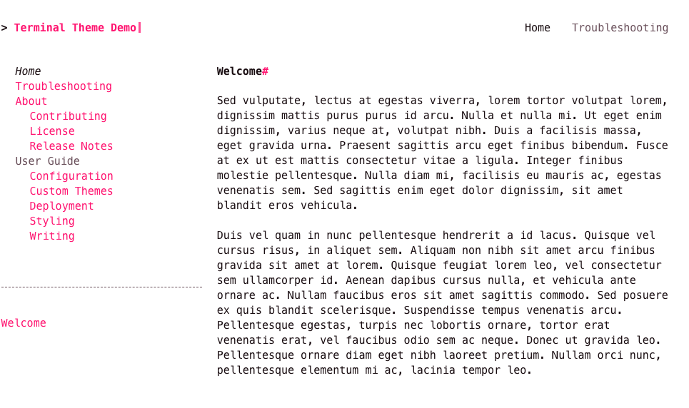

# Pink Palette

{title='Pink Color Palette'; alt='screenshot of demo site with the pink color palette.  the site uses a white background with pink hyperlinks.'; class='palette_example'}

To use the pink color palette, add the `palette` attribute to your theme configuration in `mkdocs.yml`:

```yaml
theme:
  name: terminal
  palette: pink
```