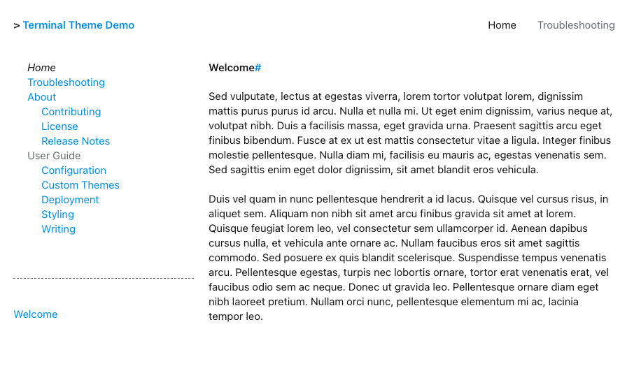

# Sans Palette

{title='Sans Color Palette'; alt='screenshot of demo site with the sans color palette.  the site uses a white background with light blue hyperlinks and sans font.'; class='palette_example'}

To use the sans color palette, add the `palette` attribute to your theme configuration in `mkdocs.yml`:

```yaml
theme:
  name: terminal
  palette: sans
```