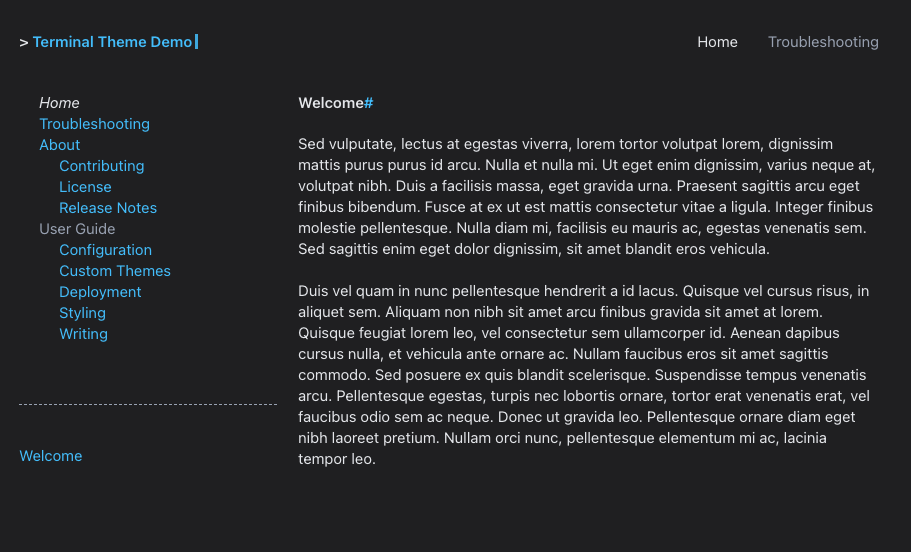

# Sans Dark Palette

{title='Sans Dark Color Palette'; alt='screenshot of demo site with the sans_dark color palette.  the site uses a black background with light blue hyperlinks and white text in sans font.'; class='palette_example'}

To use the sans_dark color palette, add the `palette` attribute to your theme configuration in `mkdocs.yml`:

```yaml
theme:
  name: terminal
  palette: sans_dark
```