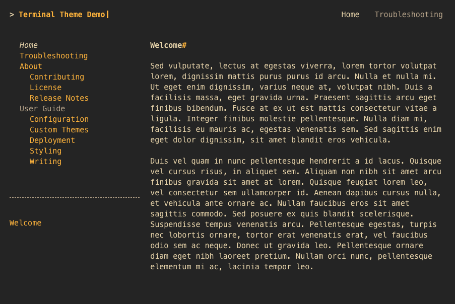
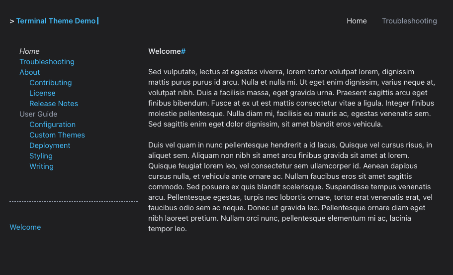
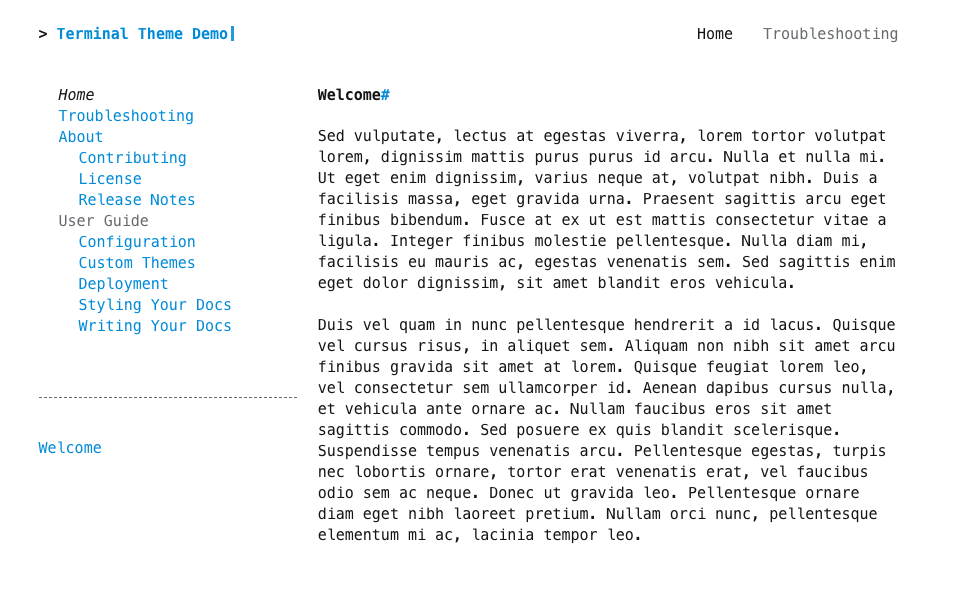

{title='Dark Color Palette'; alt='screenshot of demo site with the dark color palette.  the site uses a black background with light blue hyperlinks and white text.'; class='palette_example'}

{title='Gruvbox Dark Color Palette'; alt='screenshot of demo site with the gruvbox_dark color palette.  the site uses a dark grey background with orange hyperlinks and light yellow text.'; class='palette_example'}

{title='Pink Color Palette'; alt='screenshot of demo site with the pink color palette.  the site uses a white background with pink hyperlinks.'; class='palette_example'}

{title='Sans Dark Color Palette'; alt='screenshot of demo site with the sans_dark color palette.  the site uses a black background with light blue hyperlinks and white text in sans font.'; class='palette_example'}

{title='Sans Color Palette'; alt='screenshot of demo site with the sans color palette.  the site uses a white background with light blue hyperlinks and sans font.'; class='palette_example'}

{title='Default Color Palette'; alt='screenshot of demo site with the default color palette.  the site uses a white background with light blue hyperlinks.'; class='palette_example'}
