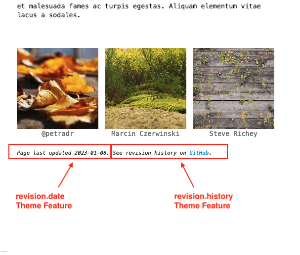

# Git Revision Date Plugin
The third-party [git-revision-date plugin] automatically adds the last revision date of a markdown page to its MkDocs Page Metadata[^mkdocs-page-meta].  

[git-revision-date plugin]: https://github.com/zhaoterryy/mkdocs-git-revision-date-plugin
[MkDocs Page Metadata]: https://www.mkdocs.org/user-guide/writing-your-docs/#meta-data
[^mkdocs-page-meta]: see [MkDocs Page Metadata] for more info

# Built-in Support
When the `git-revision-date` plugin is installed and enabled and the `revision.date` theme feature is enabled, Terminal for MkDocs will display the date of the most recent change to a page's source file on the rendered site page.  This component is added at the bottom of each page unless [page-specific hiding] is enabled.

<section markdown>
<figure markdown>
{title="Terminal for MkDocs adds 'Page last updated' text when plugin is enabled"; alt="screenshot with revision date Terminal component annotated" .terminal-mkdocs-thin-border }
<figcaption>Built-in Git Revision Date Plugin Support</figcaption>
</figure>
</section>
<br>

[page-specific hiding]: ../../features#page-features


# Quick Setup

## 1. Install Plugin
Add the package to your `requirements.txt` file:

```text
# MkDocs Plugins
mkdocs-git-revision-date-plugin
```

Then run:  `pip install -r ./requirements.txt`


## 2. Enable Plugin

Enable the Git Revision Date Plugin by adding `git-revision-date` to the `plugins` list in `mkdocs.yml`:
```yaml
plugins:
  - search
  - git-revision-date
```

## 3. Enable Theme Feature  
Enable the "Page last updated" theme component by adding `revision.date` to the theme's `features` list in `mkdocs.yml`:
```yaml
theme:
  name: terminal
  features:
    - revision.date
```
<br>

# Advanced Configuration
There are two revision-related theme features that can be individually enabled.  The example above only discusses `revision.date` as it is easier to configure without error.  

The second revision-related theme feature is `revision.history`.  Enabling this theme feature will add a "See revision history..." note to the bottom of the page.  The link included in this note relies on MkDocs' [repo_url], [repo_name], and [edit_uri]/[edit_uri_template] settings.  

[repo_url]: https://www.mkdocs.org/user-guide/configuration/#repo_url
[repo_name]: https://www.mkdocs.org/user-guide/configuration/#repo_name
[edit_uri]: https://www.mkdocs.org/user-guide/configuration/#edit_uri
[edit_uri_template]: https://www.mkdocs.org/user-guide/configuration/#edit_uri_template

<section markdown>
<figure markdown>
{title="'Page last updated' text and 'See revision history' text are controlled by separate theme features"; alt="screenshot with revision.date component and revision.history component marked" .terminal-mkdocs-thin-border }
<figcaption markdown>*revision.date* and *revision.history* Theme Features</figcaption>
</figure>
</section>
<br>

Currently the `revision.history` theme feature supports three repository hosts: [GitHub], [Bitbucket], and [Codeberg].  See below for example configurations.  

[GitHub]: git-revision.md#github
[Bitbucket]: git-revision.md#bitbucket
[Codeberg]: git-revision.md#codeberg

## GitHub

### MkDocs project in root directory
```yaml
repo_url: https://github.com/ntno/ntno.net  
edit_uri: edit/main/docs/

plugins:
  - git-revision-date

theme:
  name: terminal
  features:
    - revision.date
    - revision.history  
```

### MkDocs project in child 'documentation' directory
```yaml
repo_url: https://github.com/ntno/mkdocs-terminal
edit_uri_template: https://github.com/ntno/mkdocs-terminal/edit/main/documentation/docs/{path}

plugins:
  - git-revision-date

theme:
  name: terminal
  features:
    - revision.date
    - revision.history  
```

## Bitbucket
### MkDocs project in root directory
```yaml
repo_url: https://bitbucket.org/norganick/demo
edit_uri_template: src/main/docs/{path}?mode=edit

plugins:
  - git-revision-date

theme:
  name: terminal
  features:
    - revision.date
    - revision.history  
```

## Codeberg
### MkDocs project in root directory
```yaml
repo_url: https://codeberg.org/exampleUser/exampleRepository
edit_url_template: _edit/main/docs/{path}

plugins:
  - git-revision-date

theme:
  name: terminal
  features:
    - revision.date
    - revision.history
```

## Adding Repository Hosts
If your repository is not stored on GitHub, Bitbucket, or Codeberg and you would like to use this feature please [submit a feature request] on GitHub.  

You can further customize what revision information is included on the page by implementing your own `revision` template block.  See [Blocks] for more information.

[submit a feature request]: https://github.com/ntno/mkdocs-terminal/issues/new/choose
[Blocks]: ../../blocks 
