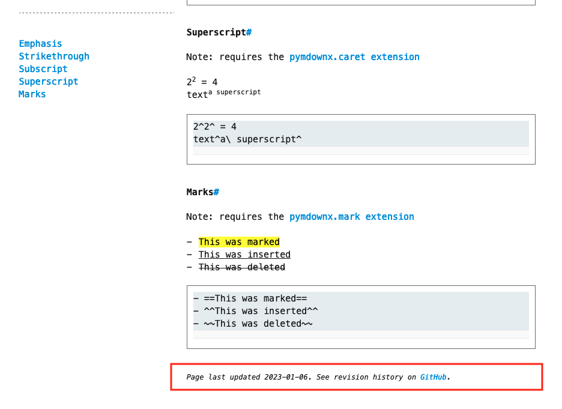
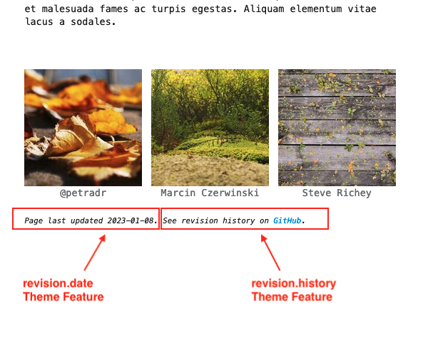

# Git Revision Date Plugin
The third-party [git-revision-date]{target="_blank"} plugin automatically adds the last revision date of a markdown page to its MkDocs Page Metadata[^mkdocs-page-meta].  

[git-revision-date]: https://github.com/zhaoterryy/mkdocs-git-revision-date-plugin
[MkDocs Page Metadata]: https://www.mkdocs.org/user-guide/writing-your-docs/#yaml-style-meta-data
[^mkdocs-page-meta]: see [MkDocs Page Metadata]{target="_blank"} for more information

# Built In Support
When the `git-revision-date` plugin is installed and enabled and the `revision.date` theme feature is enabled, Terminal for MkDocs will display the date of the most recent change to a page's source file on the rendered site page.  This component is added at the bottom of each page unless [page-specific hiding] is enabled.

<section markdown>
<figure markdown>
{title="Terminal for MkDocs adds 'Page last updated' text when plugin is enabled"; alt="screenshot with revision date Terminal component annotated" .terminal-mkdocs-thin-border }
<figcaption>Built In Git Revision Date Plugin Support</figcaption>
</figure>
</section>
<br>

[page-specific hiding]: git-revision.md#advanced-configuration


## Quick Setup

## 1. Install Plugin
Add the package to your `requirements.txt` file:

```text
# MkDocs Plugins
mkdocs-git-revision-date-plugin
```

Then run:  `pip install -r ./requirements.txt`


## 2. Enable Plugin

Enable the Git Revision Date Plugin by adding `git-revision-date` to the `plugins` configuration in `mkdocs.yml`:
```yaml
plugins:
  - git-revision-date
```

## 3. Enable Theme Feature  
Turn on the "Page last updated" theme component by adding `revision.date` to the theme's `features` list in `mkdocs.yml`:
```yaml
theme:
  name: terminal
  features:
    - revision.date
```
<br>

## Advanced Configuration
There are two revision-related Theme Features that can be individually enabled.  The example above only discusses `revision.date` as it is easier to configure without error.  

The second revision Theme Feature is `revision.history`.  Enabling this feature will add a "See revision history..." note to the bottom of the page.  This feature relies on MkDocs' [repo_url]{target="_blank"}, [repo_name]{target="_blank"}, and [edit_uri]{target="_blank"}/[edit_uri_template]{target="_blank"} settings.  

[repo_url]: https://www.mkdocs.org/user-guide/configuration/#repo_url
[repo_name]: https://www.mkdocs.org/user-guide/configuration/#repo_name
[edit_uri]: https://www.mkdocs.org/user-guide/configuration/#edit_uri
[edit_uri_template]: https://www.mkdocs.org/user-guide/configuration/#edit_uri_template

<section markdown>
<figure markdown>
{title="'Page last updated' text and 'See revision history' text are controlled by separate theme features"; alt="screenshot with revision.date component and revision.history component marked" .terminal-mkdocs-thin-border }
<figcaption>'revision.date' and 'revision.history' Theme Features</figcaption>
</figure>
</section>
<br>

Currently the `revision.history` Theme Feature supports two repository hosts, [GitHub] and [Bitbucket].  See below for example configurations.  

[GitHub]: git-revision.md#github
[Bitbucket]: git-revision.md#bitbucket

#### GitHub

#### MkDocs project in root directory
```yaml
repo_url: https://github.com/ntno/ntno.net  
edit_uri: edit/main/docs/

plugins:
  - git-revision-date

theme:
  name: terminal
  features:
    - revision.date
    - revision.history  
```

#### MkDocs project in child 'documentation' directory
```yaml
repo_url: https://github.com/ntno/mkdocs-terminal
edit_uri_template: https://github.com/ntno/mkdocs-terminal/edit/main/documentation/docs/{path}

plugins:
  - git-revision-date

theme:
  name: terminal
  features:
    - revision.date
    - revision.history  
```

#### Bitbucket
#### MkDocs project in root directory
```yaml
repo_url: https://bitbucket.org/norganick/demo
edit_uri_template: src/main/docs/{path}?mode=edit

plugins:
  - git-revision-date

theme:
  name: terminal
  features:
    - revision.date
    - revision.history  
```


### Adding Repository Hosts
If your repository host is not supported, you can override the `revision` block and include your own implementation for `revision.history`.  See [Blocks] for more information on overriding theme blocks.

[Blocks]: ../../blocks 