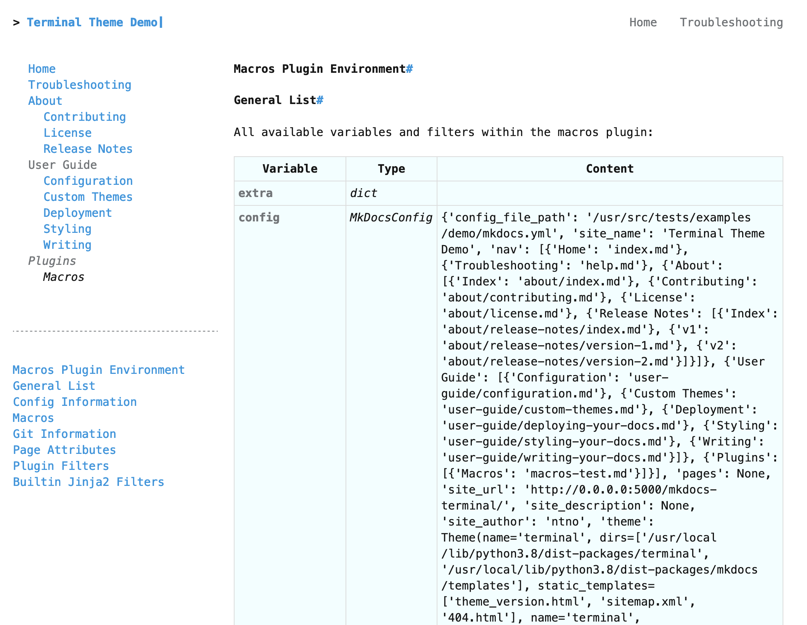

# MkDocs Macros Plugin

The third-party [macros]{target="_blank"} plugin transforms markdown pages into [jinja2]{target="_blank"} templates.  This allows you to create more complex and feature-rich pages using variables, calls to custom functions, and filters.  

You can write and publish your own functions for the plugin.  These are called macros.  You can also install macros written by others via pip.  Once a macro has been installed, it musst be enabled in your MkDocs config before you can use it.

[macros]: https://mkdocs-macros-plugin.readthedocs.io/en/latest/
[jinja2]: https://jinja.palletsprojects.com/en/3.1.x/intro/

# Quick Setup

## 1. Install Plugin
Add the `mkdocs-macros-plugin` package to your `requirements.txt` file:

```text
# MkDocs Plugins
mkdocs-macros-plugin
```

Then run:  `pip install -r ./requirements.txt`


## 2. Enable Plugin

Enable the MkDocs Macros Plugin by adding `macros` to the `plugins` list in `mkdocs.yml`:
```yaml
plugins:
    - search
    - macros
```


## 3. Verify Setup

Test that the plugin is working correctly by calling the built-in info macro to one of your documentation pages:  
```markdown
# Test Page
{{ macros_info() }}
```  
You should see a table with entries describing the MkDocs configuration for your site and details about the build environment:

<section markdown>
<figure markdown>
{alt="data table with entries corresponding to attributes in mkdocs.yml." .terminal-mkdocs-thin-border }
<figcaption>Info Macro Output</figcaption>
</figure>
</section>


