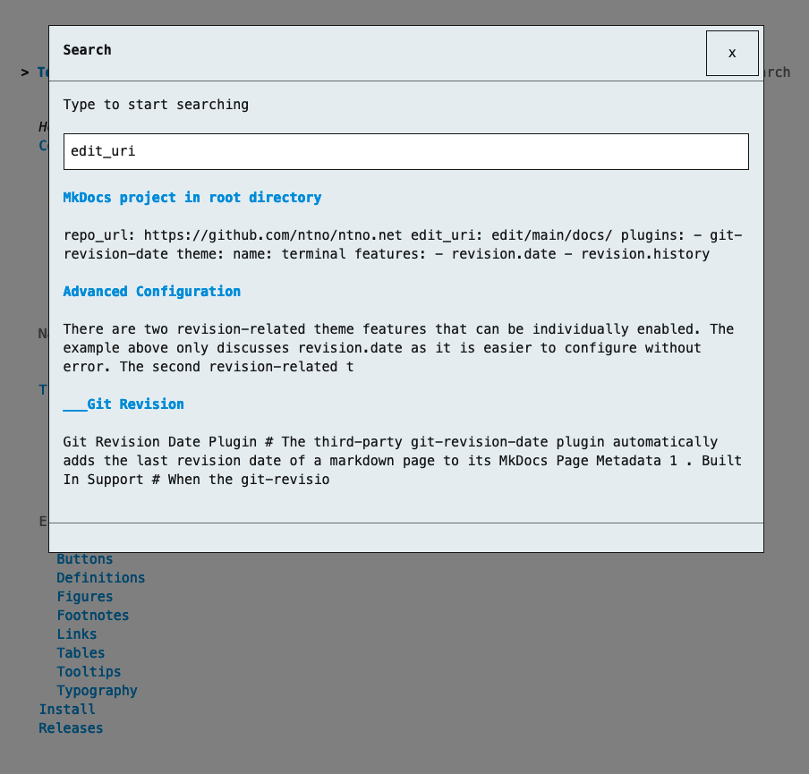

# Search Plugin
MkDocs comes with a built-in and automatically enabled [search plugin]{target="_blank"}.  

[search plugin]: https://www.mkdocs.org/user-guide/configuration/#search

# Built-in Support
Terminal for MkDocs supports the built-in search plugin by providing a search button in the top navigation bar and a search modal to display search results:

<section markdown>
<figure markdown>
{title="Terminal for MkDocs adds search modal when plugin is enabled"; alt="screenshot with search modal displaying search results" .terminal-mkdocs-thin-border }
<figcaption>Built-in Search Plugin Support</figcaption>
</figure>
</section>
<br>


## Configuration
The search button in the top navigation bar can be hidden by adding `navigation.top.search_button.hide` to your theme feature configuration in `mkdocs.yml`:

```yaml
theme:
  name: terminal
  features:
    - navigation.top.search_button.hide
```