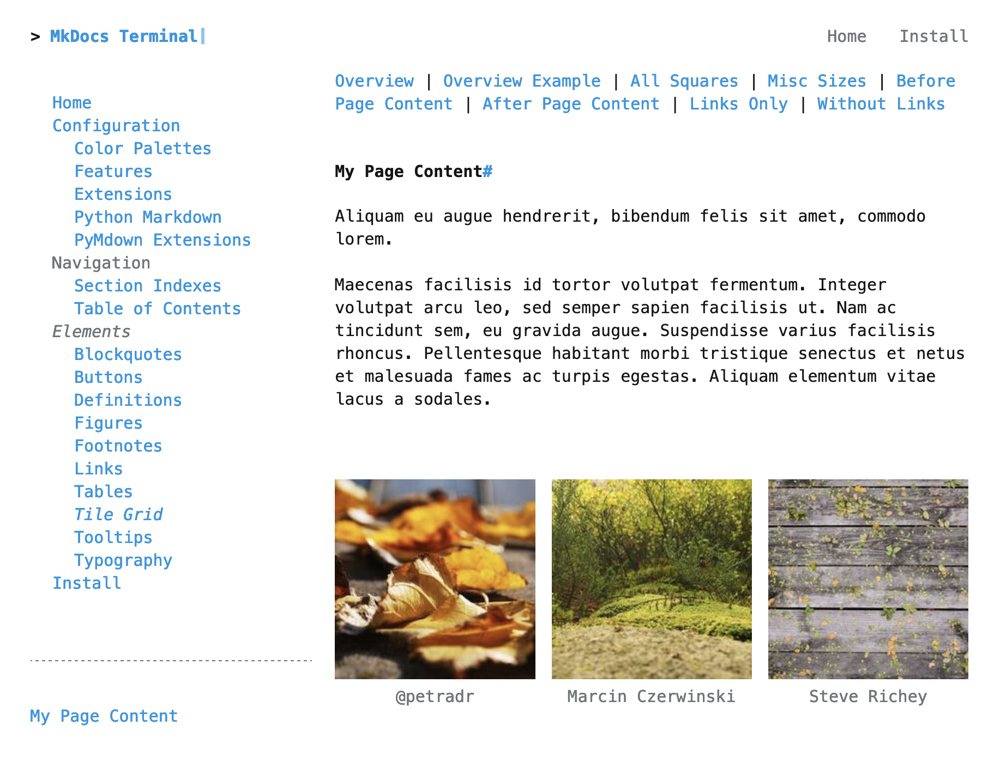

--8<--
elements/tile-grid/links.md
--8<--

# Terminal for MkDocs Tile Grid
Terminal for MkDocs enables you to quickly create a grid of linked tiles.  Each tile can contain an image (with optional caption, title, and alt text), link, and caption.

<section markdown>
<figure markdown>
 <a href="example-page">
{title="to tile grid example page"; alt="screenshot of web page with three square images in a row" .terminal-mkdocs-thin-border }
</a>
<figcaption>Tile Grid Example</figcaption>
</figure>
</section>
<br>

# Setup
To use this feature, complete the following steps:

## 1. Add `tiles` Metadata
Add a [YAML Style Meta-Data]{target="_blank"} section to the very top of your Markdown page.  The metadata should contain the attribute `tiles` which is a list of YAML objects.  Pay special attention to the indentation.  There should be two spaces before the `-` marking the start of an object.  There should be four spaces before an object's attribute.  

```markdown
---
tiles:
  - caption: '@petradr'
    img_src: https://picsum.photos/id/167/200/200
  - caption: 'Marcin Czerwinski'
    img_src: https://picsum.photos/id/127/200/200
  - caption: 'Steve Richey'
    img_src: https://picsum.photos/id/143/200/200
---

# Page Content as usual...
```

Each tile object may have any of the attributes [described below](#terminal-for-mkdocs-tile-attributes).

## 2. Add Page to Nav
Since Terminal for MkDocs' Tile Grid relies on MkDocs Page Metadata[^mkdocs-page-meta], MkDocs must load the markdown file as a MkDocs Page Object[^mkdocs-page-object].  This means that the markdown which includes the `tiles` metadata, `example-page.md`, **must** be added to the site's navigation in `mkdoc.yml`:

```
nav:
    - Home: 'index.md'
      ...
    - Elements:
      - Blockquotes: 'elements/blockquotes.md'
        ...
      - Tile Grid:
        - Example Page: 'elements/tile-grid/example-page.md'
      - Tooltips: 'elements/tooltips.md'
      - Typography: 'elements/typography.md'
    - Install: 'install.md'
```
[^mkdocs-page-meta]: [MkDocs Page Metadata]{target="_blank"}
[^mkdocs-page-object]: [MkDocs Page Object]{target="_blank"}

[YAML Style Meta-Data]: https://www.mkdocs.org/user-guide/writing-your-docs/#yaml-style-meta-data
[MkDocs Page Object]: https://www.mkdocs.org/dev-guide/themes/#navigation-objects
[MkDocs Page Metadata]: https://www.mkdocs.org/dev-guide/themes/#mkdocs.structure.pages.Page.meta
[Markdown Metadata]: https://www.mkdocs.org/user-guide/writing-your-docs/#meta-data

## Complete Example

```markdown
--8<--
elements/tile-grid/example-page.md
--8<--
```


# Tile Attributes
Each tile may have the following attributes:

`caption`

:   *Optional*.  The figure caption.

`img_src`

:   *Optional*.  The image source.  Can be an external image like `https://picsum.photos/id/167/200/200` or an internal MkDocs image like `../../img/palettes/default.png`.

`img_title`

:   *Optional*.  Text to display on hover.

`img_alt`

:   *Optional*.  Alternate text for the image if the image cannot be displayed.

`url`

:   *Optional*.  Link target.  Can be an external web page or an internal MkDocs page like `./default/`.
