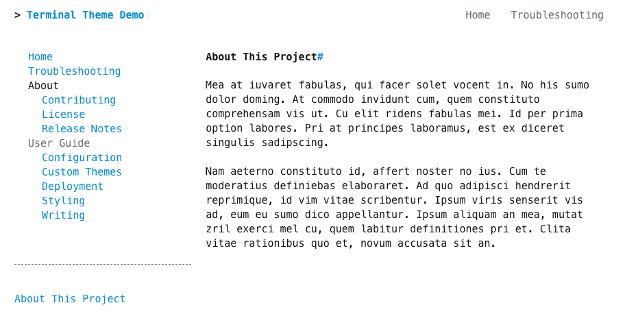
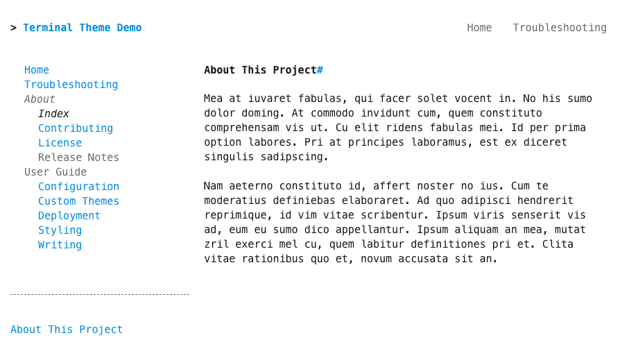

When section index pages are enabled, documents can be directly attached to sections.  This is particularly useful for providing overview pages. Add the `navigation.side.indexes` feature to the theme configuration in `mkdocs.yml`:

``` yaml
theme:
  name: terminal
  features:
    - navigation.side.indexes
```

Then add a page with the title 'Index' as a subpage in the `nav` config in `mkdocs.yml`:
```yaml
nav:
    - Home: 'index.md'
    - Troubleshooting: 'help.md'
    - About: 
      - Index: 'about/index.md'
      - Contributing: 'about/contributing.md'
      - License: 'about/license.md'
      - Release Notes:
        - Index: 'about/release-notes/index.md'
        - v1: 'about/release-notes/version-1.md'
        - v2: 'about/release-notes/version-2.md'
```
<br>

<hr>

## With Section Indexes
*About* and *Release Notes* are clickable in the side navigation.  The index page for the *About* section does not appear as a sub page of the *About* category:

{title="'About' and 'Release Notes' are clickable in the side navigation"; alt="'Release Notes' is rendered as a clickable link in the side navigation"}

<hr>

## Without Section Indexes
*About* and *Release Notes* are not clickable in the side navigation.  Instead, they are rendered as greyed out text.  The index page for the *About* section appears as a sub page of the *About* category:

{title="'About' and 'Release Notes' are not clickable in the side navigation"; alt="'Release Notes' is rendered as greyed out text in the side navigation"}


