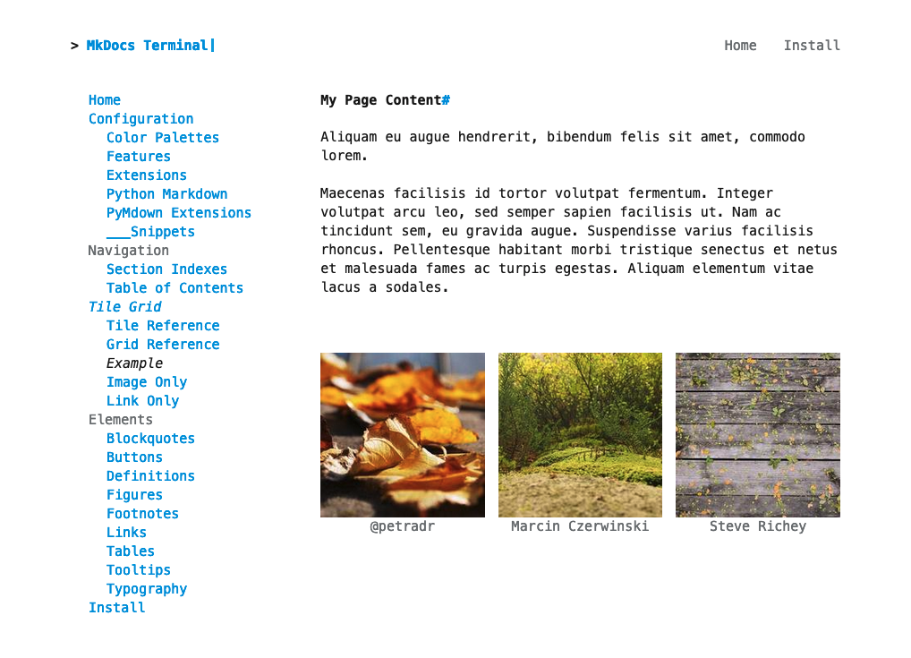

# Terminal for MkDocs Tile Grid

Terminal for MkDocs enables you to quickly create a grid of linked tiles.  Each tile can contain an image, link, and caption.

<section markdown>
<figure markdown>
 <a href="examples/example-page">
{title="to tile grid example page"; alt="web page with three square images in a row.  images appear after Lorem Ipsum text." .terminal-mkdocs-thin-border }
</a>
<figcaption>Tile Grid Example</figcaption>
</figure>
</section>
<br>

To use this feature, complete the following steps:

## 1. Add `tiles` to Page Metadata
Add a [YAML Style Meta-Data] section to the very top of your Markdown page.  The metadata should contain the attribute `tiles` which is a list of YAML objects.  

Pay special attention to the indentation.  There should be two spaces before the `-` marking the start of an object.  There should be four spaces before any additional object attribute:  

```markdown
---
tiles:
  - caption: '@petradr'
    img_src: https://picsum.photos/id/167/200/200
  - caption: 'Marcin Czerwinski'
    img_src: https://picsum.photos/id/127/200/200
  - caption: 'Steve Richey'
    img_src: https://picsum.photos/id/143/200/200
---

# My Page Content
```

Each tile object may have any of the attributes described in the [Tile Reference](tile.md).


## 2. Add Page to Nav
Add the markdown file which includes the `tiles` metadata to the site's navigation in `mkdocs.yml`.  If the page is not included in the `mkdocs.yml` *nav*, the markdown will not be loaded as a MkDocs Page Object[^mkdocs-page-object] and will not include your metadata.

*Note*: the page does not need to be visible in the final [side navigation theme component](../configuration/).  Deeply nested pages can also use the tile grid feature.  

```
nav:
    - Home: 'index.md'
    - Example Page: 'tile-grid/examples/example-page.md'
    - Tile Grid:
      - Examples:
        - Also Works: 'tile-grid/examples/example-page.md'
```

[^mkdocs-page-object]: [MkDocs Page Object]
[^mkdocs-page-meta]: [MkDocs Page Metadata]

[YAML Style Meta-Data]: https://www.mkdocs.org/user-guide/writing-your-docs/#yaml-style-meta-data
[MkDocs Page Object]: https://www.mkdocs.org/dev-guide/themes/#navigation-objects
[MkDocs Page Metadata]: https://www.mkdocs.org/dev-guide/themes/#mkdocs.structure.pages.Page.meta
[Markdown Metadata]: https://www.mkdocs.org/user-guide/writing-your-docs/#meta-data

## 3. Configure Tile Grid
The Tile Grid can be further configured using the attributes described in the [Grid Reference](grid.md).  For example, the grid can be configured to display before the main page content:

```markdown
---
show_tiles_first: true
tiles:
  - caption: '@petradr'
    ...
```


# Complete Example

## mkdocs.yml
file location: `.`  
filename: `mkdocs.yml`  

```
site_name: Tile Grid Demo

nav:
    - Home: 'index.md'
    - Example Page: 'tile-grid/examples/example-page.md'

theme:
  name: terminal
```
## example-page.md
file location: `./docs/tile-grid/examples/example-page.md`  
filename: `example-page.md`  

```markdown
--8<--
tile-grid/examples/example-page.md
--8<--
```
