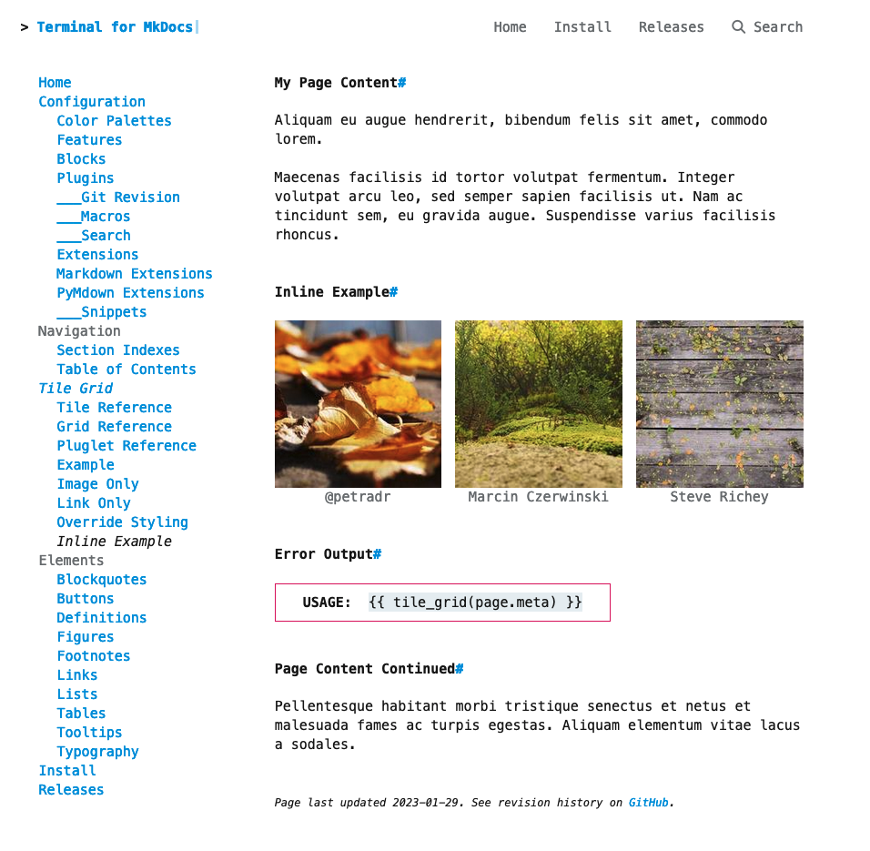

# Tile Grid Pluglet Reference

By default the Terminal for MkDocs Tile Grid is displayed using logic in the theme's templates.  These templates add components around the page's markdown content (for example, the side navigation menu or the latest git revision date for the page).

We can use the MkDocs Macros Plugin to affect what appears within the page's markdown content; i.e., inline.  This plugin, in combination with Terminal for MkDocs' built-in Tile Grid Pluglet, will render the tile grid within a page's markdown content instead of before or after the markdown content.

<section markdown>
<figure markdown>
{alt="web page with three square images in a row.  images appear in between Lorem Ipsum paragraphs." .terminal-mkdocs-thin-border }
<figcaption markdown>[Tile Grid Inline Example](../examples/inline)</figcaption>
</figure>
</section>
<br>

# Setup
Follow the instuctions in the [MkDocs Macros Plugin] reference.  Then enable the Terminal for MkDocs Tile Grid Pluglet by adding  
```text
mkdocs-terminal:terminal.pluglets.tile_grid.main
```  
to the `modules` config option of the `macros` plugin:

```yaml
plugins:
  - search
  - macros:
      modules: 
        - mkdocs-terminal:terminal.pluglets.tile_grid.main
```
[MkDocs Macros Plugin]: ../../configuration/plugins/macros

# Usage

## 1. Define Grid
Define your tile grid according to the [Tile Grid Overview].  

[Tile Grid Overview]: ../

## 2. Configure Grid  
Set `show_tiles_inline` to `true`.   

## 3. Call tile_grid Macro
Add the following macro call wherever on the page you would like the grid to be displayed:

```markdown
{{ tile_grid(page.meta) }}
```

# Example

```markdown
--8<--
tile-grid/examples/inline.md
--8<--
```
